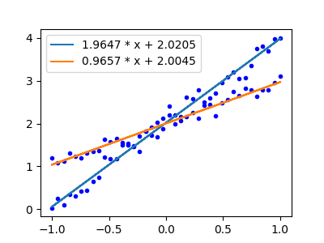

# Lines

Identify multiple lines among a set of points.
-----------------------------------------------

Background
==========

It is sometimes required that multiple lines can be extracted from an ensemble of points. This package provides a simple method in dealing with such classification problem. 

A point is defined as a three element tuple *(x,y,weight)*. And each line is associated with a slope **a** and an intercept **b**. We can define the *Residual Sum of Squares* (RSS) of weighted points as  $RSS = \sum_{i=1}^{n} {w_i * (y_i - a x_i - b)^2}$, where $w_i$ is a weight of the corresponding point. By making the gradient of an RSS equals to zero:

$\frac{\partial RSS}{\partial b} = \sum_{i=1}^{n} {-2 w_i * (y_i - a x_i - b) } = 0 $

$\frac{\partial RSS}{\partial a} = \sum_{i=1}^{n} {-2 w_i * x_i * (y_i - a x_i - b) } = 0 $

We have:

$ a = \frac{\sum_{i} {w_i * x_i * y_i} - (\sum_{i} {w_i x_i}) (\sum_{i} {w_i y_i})/\sum_{i} {w_i}}
 {\sum_{i} {w_i {x_i}^2} - \frac{(\sum_{i} {w_i x_i})^2} {\sum_{i} {w_i}}
$

Thus the line can be uniquely defined which will result in a minimum RSS.

However, when multiple lines are presented, one needs to evaluate the RSS of each line to determine which one a point belongs to.

