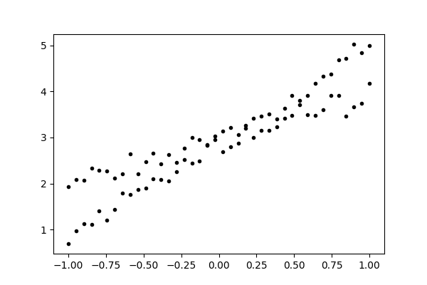
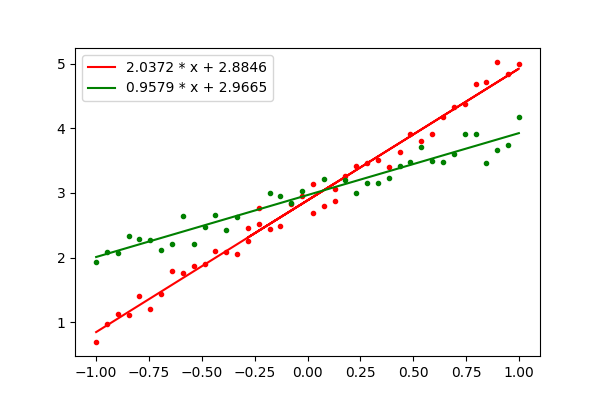
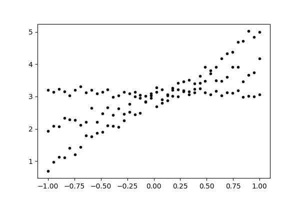

# Lines

Identify multiple lines among a set of points.
-----------------------------------------------

Background
==========

Sometimes one needs to extract multiple lines from an ensemble of points. This package provides a simple method in dealing with such classification and regression problem. 

A point is defined as a three element tuple *(x,y,weight)*. And each line is associated with a slope **a** and an intercept **b**. We can define the *Residual Sum of Squares* (RSS) of weighted points by taking the weight into account as well. a and b can be calculated by equal gradient of RSS to zero. Once a set of points are assigned to a line, to determine the slope and intercept of a line can always be done in O(n^2) at least.

However, when the set of points potentially belong to multiple lines, it would be convenient to accomplish classification and regression at the same time. This package provides one solution in polynomial time in assisting such kind of task. An immediate application is for spectral analysis in HYSCORE EPR spectroscopy.

Usage
=====

Demonstration are shown in example1.py and example2.py. In both examples, one needs to specify the *penalty* for adding a new line. However, one do **not** need to set the number of lines the classifier is looking for. The classifier is capable to identify the correct number of lines in both cases.

**example1.py** shows the identification of two crossing lines:
---------------------------------------------------------

+ Prediction:

The data was generated using two lines: 

y = 2 x + 2.9 

y = 1 x + 3.0

noise was added to mimic real cases.

The classifier is able to identify two lines for these points.

**example2.py** shows the identification of three crossing lines:
---------------------------------------------------------

+ Prediction:

The data was generated using **three** lines: 

y = 2 x + 2.9 

y = 1 x + 3.0

y = -0.1 x + 3.1

The classifier is able to identify three lines for these points.

Discussion
==========

+  The classifier is able to handle cases where lines are crossing.

+  User needs to tune parameter 'penalty' when using the classifier.

